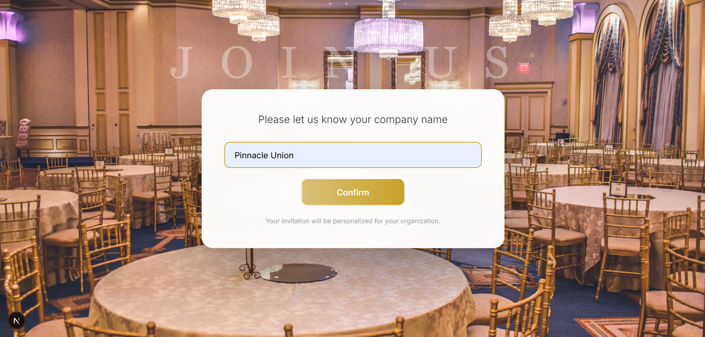
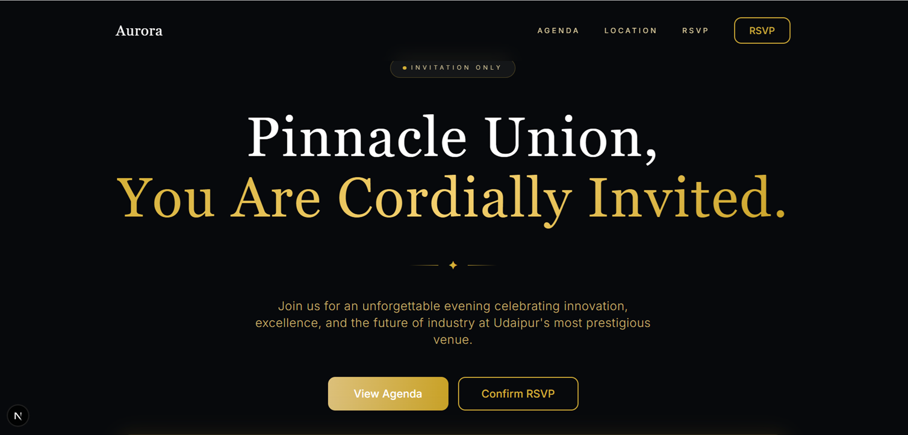
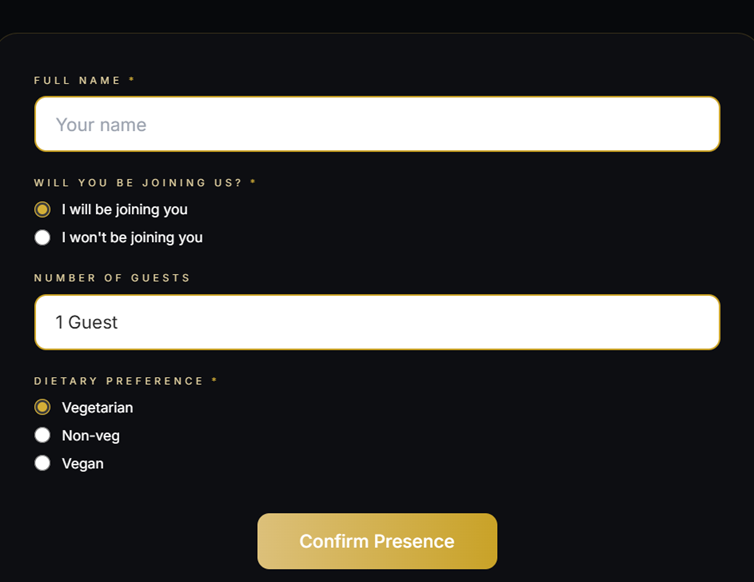

# AI-Powered Corporate Event Invitation Website

An AI-assisted corporate event invitation web application built using KiloCode workflows to manage event communication, attendee registration, and responsive user interaction through a modern frontend architecture.

Live Demo : [Click Here](https://ai-powered-corporate-event-invitati-beige.vercel.app/)

Demo Video : [Click Here](https://youtu.be/5_2dBgt5Fe4)

### 🧩 Domain: Corporate Event Management / Event Invitation Platform

### Function: An AI-assisted web application designed to manage and streamline corporate event invitations, attendee registration workflows, and interactive event communication through a modern responsive interface.

### Difficulty: Intermediate

The project involved:

AI-assisted frontend development workflows using KiloCode
Requirement-based implementation
Responsive UI development
Modular component structuring
Popup workflow integration
Google Form integration for attendee data collection
Next.js project configuration
Debugging and issue resolution
Frontend architecture organization 

---

## 📌 Table of Contents
- <a href="#overview">Project Overview</a>
- <a href="#features">Features</a>
- <a href="#tech-stack">Tech Stack</a>
- <a href="#folder-structure">Folder Structure</a>
- <a href="#project-documentation">Project Documentation</a>
- <a href="#key-functionalities">Key Functionalities</a>
- <a href="#challenges-faced">Challenges Faced</a>
- <a href="#key-learnings">Key Learnings</a>
- <a href="#screenshots">Screenshots</a>
- <a href="#installation-and-setup">Installation & Setup</a>
- <a href="#future-improvements">Future Improvements</a>
- <a href="#author--contact">Author & Contact</a>

---

# Project Overview

This project was developed using an AI-assisted development workflow with KiloCode.

Instead of manually writing every line of code from scratch, the project was created through:

* Requirement definition
* Structured prompting
* Iterative UI refinement
* Debugging and testing
* Feature validation
* Component integration
* Project organization

The goal was to understand and apply modern AI-assisted software development practices while building a functional real-world web application.

---

# Features

✅ Responsive corporate event landing page
✅ Interactive invitation popup design
✅ Attendee registration workflow
✅ Google Form integration for data collection
✅ Context & hooks-based architecture
✅ Documentation-driven implementation

---

# Tech Stack

| Technology   | Purpose                  |
| ------------ | ------------------------ |
| Next.js      | Frontend Framework       |
| React        | UI Development           |
| TypeScript   | Type Safety              |
| Tailwind CSS | Styling                  |
| JavaScript   | Application Logic        |
| Google Forms | Attendee Data Collection |
| Git & GitHub | Version Control          |

---

# Folder Structure

```plaintext
my-ai-website/
│
├── public/
│   └── images/
│
├── src/
│   ├── app/
│   ├── components/
│   ├── context/
│   ├── hooks/
│   └── lib/
│
├── corporateeventinfo.md
├── corporate-event-invitation-prd.md
├── design.md
├── popupdesign.md
│
├── next.config.ts
├── package.json
├── tailwind.config.ts
├── tsconfig.json
└── README.md
```

---

# Project Documentation

The project includes multiple supporting documents for requirement planning and UI workflow understanding:

* `corporateeventinfo.md`
* `corporate-event-invitation-prd.md`
* `design.md`
* `popupdesign.md`

These documents helped structure the development workflow and UI implementation.

---

# Key Functionalities

## Corporate Event Landing Page

A responsive and visually engaging homepage designed for corporate event invitations.

## Popup Invitation System

Interactive popup flow for event engagement and attendee interaction.

## Registration Workflow

Integrated attendee registration using Google Forms for data capture and management.

## Scalable Architecture

Modular folder structure using reusable components, hooks, and context management.

---

# Challenges Faced

Some key challenges during development included:

* Managing responsive UI layouts
* Integrating popup workflows smoothly
* Structuring reusable components
* Handling frontend state efficiently
* Organizing scalable project architecture

---

# Key Learnings

Through this project, I improved my understanding of:

* Documentation-driven development
* AI-assisted software development workflows

---

# Screenshots

## Popup Design



## Homepage



## Registration Form



---

# Installation & Setup

## Clone Repository

```bash
git clone https://github.com/yourusername/your-repository-name.git
```

## Navigate to Project

```bash
cd your-repository-name
```

## Install Dependencies

```bash
npm install
```

## Run Development Server

```bash
npm run dev
```

Open:

```plaintext
http://localhost:3000
```

---

# Future Improvements

Possible future enhancements:

* Backend database integration
* Event analytics
* Email invitation automation
* Deployment optimization

---

# Author

**Rita Mahato**

Aspiring AI Enabled Data Analyst
Passionate about building real-world AI and data-driven applications using modern technologies.

Email: ds.rita.mahato@gmail.com

Linkedin : (https://www.linkedin.com/in/mahato-rita/)
